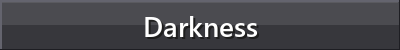
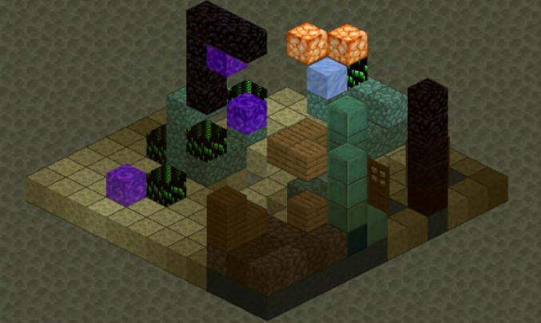
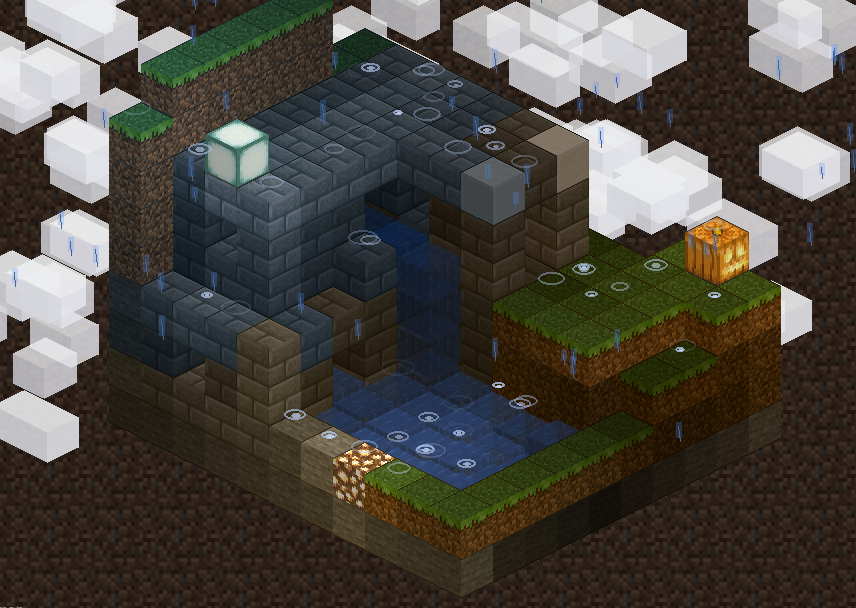

# Bite Sized Minecraft
##### An Interactive Isometric Building Simulator in Pygame. This is an unofficial fan project and is **NOT** affiliated with, endorsed by, or connected to [Mojang Studios](https://www.minecraft.net/) or Microsoft. All block textures and sound effects are sourced from the official [Minecraft Resource Pack Template](https://aka.ms/resourcepacktemplate) and the [Minecraft Wiki](https://minecraft.wiki/), used here for educational and non-commercial purposes only. Minecraft® is a registered trademark of Mojang Synergies AB. 


---

## Overview

Bite Sized Minecraft is a **creative building sandbox** that brings the essence of Minecraft's block-placing experience into a clean, isometric 2.5D perspective. Built entirely in Python with Pygame, this simulator allows users to place authentic Minecraft blocks onto a grid-based canvas, construct structures, and explore different dimensions—all with the familiar sounds and textures of the original game.


**Goal:** Provide an accessible, lightweight building sandbox where users can experiment with block placement, load pre-made structures, and explore the creative possibilities of voxel-based construction without the overhead of a full 3D engine.

---

## Features

### Block Placement & Building

The core experience revolves around intuitive block placement on an isometric grid:

- **Left Click** to place the currently selected block
- **Right Click** to remove blocks or interact (open/close doors)
- **Ghost Preview** shows where blocks will be placed before clicking
- **Brush Sizes** (1×1, 2×2, 3×3) for faster building
- **Fill Tool** for quickly filling large areas
- **Mirror Mode** for symmetrical construction

### 100+ Block Types

Over 100 authentic Minecraft blocks organized into categories:

| Category | Examples |
|----------|----------|
| **Natural** | Grass, Dirt, Stone, Sand, Gravel, Snow, Ice |
| **Wood** | Oak, Birch, Spruce, Dark Oak, Acacia, Jungle (logs, planks, leaves) |
| **Ores** | Coal, Iron, Gold, Diamond, Emerald, Lapis, Redstone |
| **Nether** | Netherrack, Soul Sand, Nether Bricks, Glowstone, Magma |
| **End** | End Stone, Purpur, Obsidian |
| **Decorative** | Glass, Wool (16 colors), Concrete, Terracotta, Bookshelves |
| **Interactive** | Doors, Stairs, Slabs, Chests, Crafting Tables |
| **Liquids** | Water, Lava (with flow simulation) |

### Special Block Behaviors

```python
# Stairs can be rotated to face different directions
if event.key == K_r:
    rotate_stair_facing()  # Cycles: North → East → South → West

# Slabs can be flipped between top and bottom position
if event.key == K_f:
    flip_slab_position()   # Toggles: Bottom ↔ Top

# Doors can be opened and closed
if right_click_on_door:
    toggle_door_state()    # Swings open/closed
```

### Pre-made Structures

Instantly place complete structures with a single click:

- **Buildings:** Simple House, Villager House, Watch Tower, Temple
- **Trees:** Oak, Birch, Spruce, Dark Oak, Jungle
- **Portals:** Nether Portal, End Portal
- **Decorative:** Fountain, Lamp Post, Desert Well
- **Nether:** Bastion Remnants, Warped Forest, Nether Fortress Bridge

---

## Interactive Tutorial

A comprehensive 17-step tutorial guides users through all features:


The tutorial covers:
1. **Basics** — Block placement, removal, and camera controls
2. **Selection** — Using the block panel and search
3. **Tools** — Fill mode, brush sizes, mirror mode
4. **Navigation** — Zoom, pan, and view rotation
5. **Advanced** — Undo/redo, save/load, structures
6. **Dimensions** — Switching between Overworld, Nether, and End
7. **Effects** — Weather, lighting, and day/night cycle

---


## Dimensions


Explore three distinct dimensions, each with unique floor textures and ambient soundscapes:

### Overworld
The default dimension with grass floors, calm meadow atmosphere, and peaceful background music.

### Nether


Enter the dangerous Nether realm featuring:
- Netherrack floor texture
- Ominous ambient rumbling
- Fiery atmosphere with Nether-themed music
- Soul sand valleys and warped forests

### The End
Journey to the mysterious End dimension with:
- End stone floor texture
- Ethereal void atmosphere
- Eerie purple ambient sounds
- End city structures

---


## Weather System


Dynamic weather effects bring your builds to life:

### Rain
- Realistic raindrop particles with varying intensity
- Splash effects when drops hit surfaces
- Thunder and lightning storms with screen flash
- Layered ambient rain sounds (Minecraft-style)

### Snow
- Gentle snowflake particles with drift physics
- Snow constrained to the building platform
- Overcast sky darkening effect

### Clouds
- Floating cloud particles across the sky
- Adjustable cloud coverage
- Smooth parallax movement

---


## Lighting System


Dynamic lighting creates depth and atmosphere:

- **Light Sources:** Glowstone, Sea Lanterns, Jack-o'-Lanterns, Torches, Shroomlight, Magma Blocks
- **Light Propagation:** Realistic falloff from light sources
- **Ambient Occlusion:** Subtle shadows in corners and crevices
- **Day/Night Cycle:** Sun and moon with smooth transitions
- **Star Field:** Twinkling stars visible at night

### Light-Emitting Blocks

```python
# Blocks with light levels
GLOWSTONE:      lightLevel = 15  # Maximum brightness
SEA_LANTERN:    lightLevel = 15
JACK_O_LANTERN: lightLevel = 15
SHROOMLIGHT:    lightLevel = 15
MAGMA_BLOCK:    lightLevel = 3   # Dim glow
LAVA:           lightLevel = 15  # Full brightness
```

---



## Day/Night Cycle & Darkness


Experience the passage of time in your world:

- **Sun Movement:** Smooth arc across the sky during daytime
- **Moon Phases:** 8 different moon phases cycling realistically
- **Sky Transitions:** Gradual color shifts from dawn to dusk
- **Star Visibility:** Stars fade in at dusk, fade out at dawn
- **Darkness Effects:** Building area dims during night

### Celestial Controls
- Toggle the sun/moon cycle on/off
- Adjust cycle speed
- Skip to specific times of day

---

## Technical Overview

### Isometric Projection

The simulator employs a **2:1 dimetric projection**, the standard for pixel-art isometric games:

```python
def world_to_screen(grid_x, grid_y, grid_z):
    """Convert 3D world coordinates to 2D isometric screen position"""
    screen_x = (grid_x - grid_y) * (TILE_WIDTH // 2) + offset_x
    screen_y = (grid_x + grid_y) * (TILE_HEIGHT // 2) - grid_z * BLOCK_HEIGHT + offset_y
    return screen_x, screen_y
```

### Depth Sorting (Painter's Algorithm)

Blocks are rendered back-to-front using the **Painter's Algorithm**:

```python
def render_world():
    """Render all blocks in correct depth order"""
    blocks_to_draw = []
    
    for (x, y, z), block_type in world.blocks.items():
        sort_key = x + y + z  # Isometric depth
        blocks_to_draw.append((sort_key, x, y, z, block_type))
    
    blocks_to_draw.sort(key=lambda b: b[0])  # Furthest first
    
    for _, x, y, z, block_type in blocks_to_draw:
        draw_block(x, y, z, block_type)
```

### Sparse World Storage

The world uses a **dictionary-based sparse storage** for memory efficiency:

```python
class World:
    """Only non-air blocks consume memory"""
    def __init__(self, width, depth, height):
        self.blocks = {}  # (x, y, z) → BlockType
        self.properties = {}  # Special block states
```

### Liquid Flow Simulation

Water and lava flow realistically:
- **Water** spreads horizontally and falls vertically
- **Lava** flows 6× slower than water (like Minecraft)
- **Interactions:** Water + Lava = Obsidian/Cobblestone

---

## Hidden Features



The world holds secrets for those who explore deeply...



*Some things are better left undiscovered.*

---

## Controls

| Input | Action |
|-------|--------|
| **Left Click** | Place block |
| **Right Click** | Remove block / Interact |
| **Middle Mouse (drag)** | Pan camera |
| **Scroll Wheel** | Zoom in/out |
| **WASD** | Move camera |
| **Q / E** | Rotate view |
| **R** | Rotate stairs |
| **F** | Flip slab / Toggle fill mode |
| **B** | Cycle brush size |
| **M** | Mirror mode (X-axis) |
| **Shift+M** | Mirror mode (Z-axis) |
| **Ctrl+Z** | Undo |
| **Ctrl+Y** | Redo |
| **Ctrl+S** | Save build |
| **Ctrl+O** | Load build |
| **H** | Show tutorial |
| **C** | Clear world |
| **1-9** | Quick select hotbar |
| **ESC** | Exit |

---

## Project Structure

```
Bite-Size-Minecraft/
├── Code/
│   ├── minecraftBuilder.py    # Main application (~17,000 lines)
│   ├── splash.py              # Splash screen module
│   ├── horror.py              # Horror system manager
│   ├── constants.py           # Shared constants and enums
│   ├── config.json            # Application configuration
│   ├── engine/                # Core engine modules
│   │   ├── world.py           # Voxel grid management
│   │   ├── renderer.py        # Isometric projection
│   │   ├── undo.py            # Command pattern undo system
│   │   └── performance.py     # Optimization utilities
│   └── saves/                 # User saves and presets
├── Assets/
│   ├── Texture Hub/           # Block and UI textures
│   ├── Sound Hub/             # Sound effects and music
│   └── Icons/                 # Application icons
└── References/                # Documentation images
```

---

## Requirements

- Python 3.8+
- Pygame 2.0+

```bash
pip install pygame
```

## Usage

```bash
cd Code
python minecraftBuilder.py
```

---

## Acknowledgments

This project would not be possible without:

- **[Mojang Studios](https://www.minecraft.net/)** for creating Minecraft and providing the resource pack template
- **[Minecraft Wiki](https://minecraft.wiki/)** for comprehensive texture and sound documentation
- **[Pygame Community](https://www.pygame.org/)** for the excellent 2D game framework

> [!NOTE]
> This simulator is intended as a creative sandbox and technical demonstration. For the full Minecraft experience, please support the official game at [minecraft.net](https://www.minecraft.net/).

---

*Author: Jeffrey Morais*
