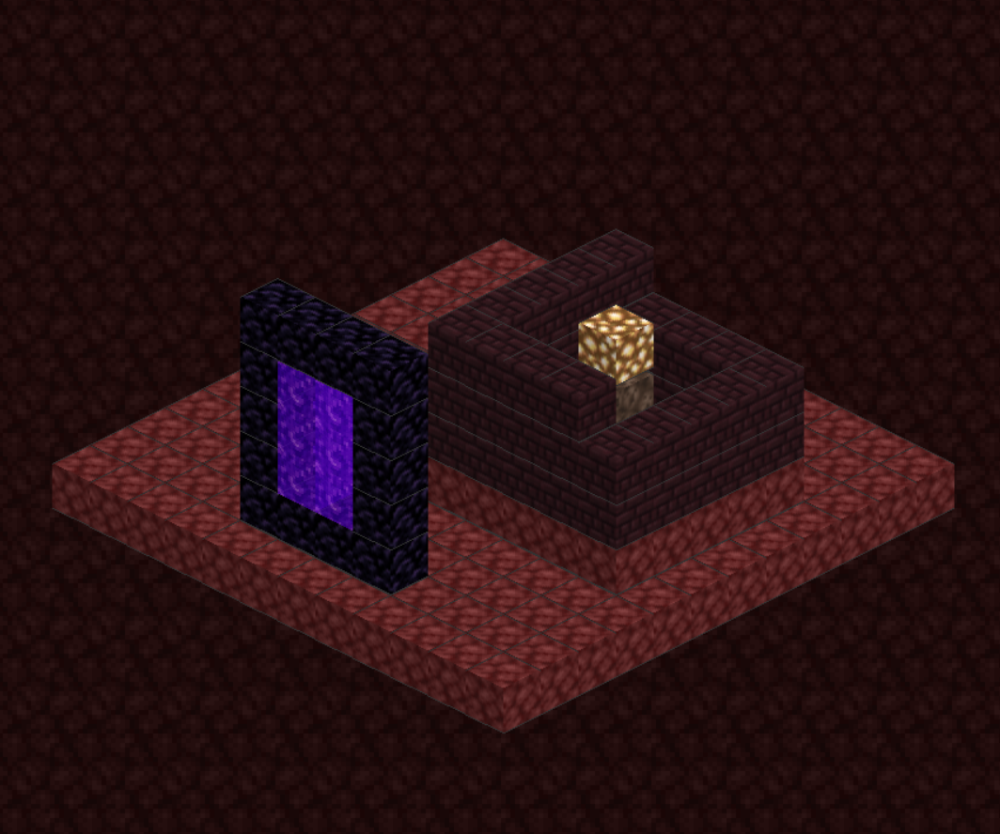
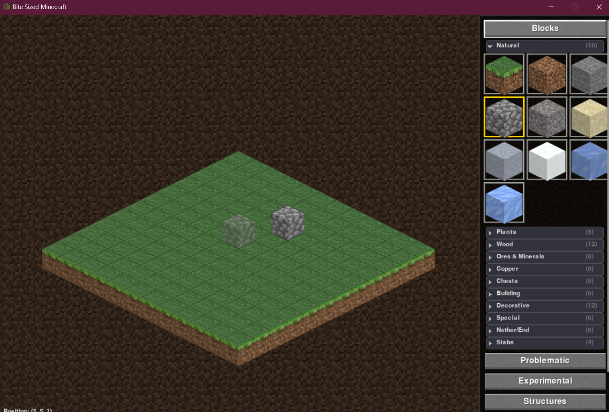
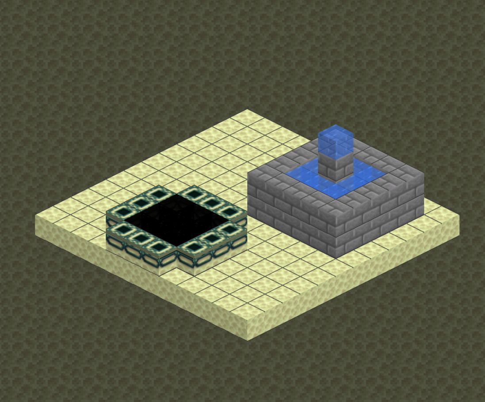
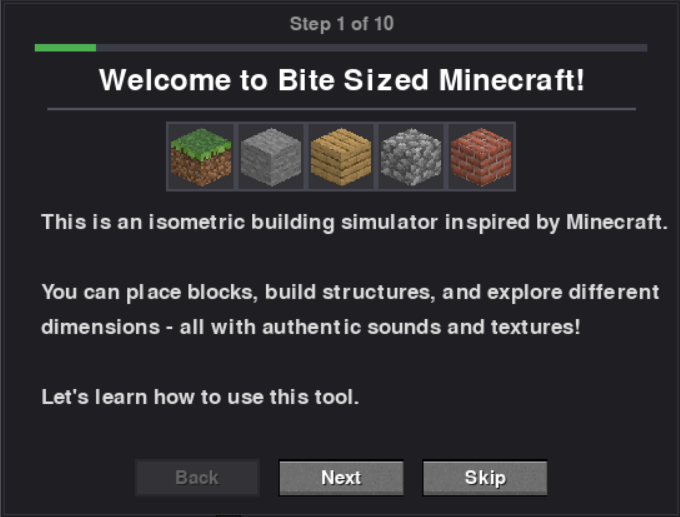

# Bite Sized Minecraft
##### An Interactive Isometric Building Simulator in Pygame. This is an unofficial fan project and is **NOT** affiliated with, endorsed by, or connected to [Mojang Studios](https://www.minecraft.net/) or Microsoft. All block textures and sound effects are sourced from the official [Minecraft Resource Pack Template](https://aka.ms/resourcepacktemplate) and the [Minecraft Wiki](https://minecraft.wiki/), used here for educational and non-commercial purposes only. Minecraft® is a registered trademark of Mojang Synergies AB. 



## Objective

Bite Sized Minecraft is a **creative building sandbox** that brings the essence of Minecraft's block-placing experience into a clean, isometric 2.5D perspective. Built entirely in Python with Pygame, this simulator allows users to drag and drop authentic Minecraft blocks onto a grid-based canvas, construct structures, and explore different dimensions—all with the familiar sounds and textures of the original game.

The project serves as both a **creative tool** for designing and visualizing Minecraft-style builds and a **technical demonstration** of isometric rendering, sprite management, and interactive GUI design in Python.

**Goal:** Provide an accessible, lightweight building sandbox where users can experiment with block placement, load pre-made structures, and explore the creative possibilities of voxel-based construction without the overhead of a full 3D engine.

## Technical Overview

### Isometric Projection

The simulator employs a **2:1 dimetric projection**, the standard for pixel-art isometric games. This projection creates the illusion of 3D depth on a 2D canvas by rendering blocks at a fixed angle where horizontal movement translates to diagonal screen movement.

The world-to-screen coordinate transformation follows the classic isometric formula, converting 3D grid positions into 2D pixel coordinates. For every two horizontal pixels, the line progresses exactly one vertical pixel, producing clean, pixel-perfect edges at approximately 26.57° (the arctangent of 0.5).

```python
def world_to_screen(grid_x, grid_y, grid_z):
    """
    Convert 3D world coordinates to 2D isometric screen position
    
    The transformation projects the 3D grid onto a 2D plane where:
    - Moving +X shifts the view right and down
    - Moving +Y shifts the view left and down  
    - Moving +Z shifts the view upward
    """
    screen_x = (grid_x - grid_y) * (TILE_WIDTH // 2) + offset_x
    screen_y = (grid_x + grid_y) * (TILE_HEIGHT // 2) - grid_z * BLOCK_HEIGHT + offset_y
    
    return screen_x, screen_y
```

### Block Rendering Pipeline

Each block is rendered as a composite isometric sprite with three visible faces (top, left, right), each with appropriate shading to simulate depth. The rendering pipeline handles texture loading, tinting (for grass and leaves), transparency, and special block variants.

```python
def create_isometric_block(top_texture, side_texture, front_texture):
    """
    Generate an isometric block sprite from face textures
    
    Face shading follows Minecraft conventions:
    - Top face: 100% brightness (direct light)
    - Right face: 85% brightness (partial shadow)
    - Left face: 70% brightness (deeper shadow)
    """
    surface = pygame.Surface((TILE_WIDTH, TILE_HEIGHT + BLOCK_HEIGHT), pygame.SRCALPHA)
    
    # Render top diamond face
    render_top_face(surface, top_texture, brightness=1.0)
    
    # Render left parallelogram face
    render_left_face(surface, side_texture, brightness=0.7)
    
    # Render right parallelogram face
    render_right_face(surface, front_texture, brightness=0.85)
    
    return surface
```



### World Data Structure

The world uses a **sparse dictionary** to store block data, where only occupied positions are tracked. This approach is memory-efficient for the typical building scenario where most of the grid remains empty.

```python
class World:
    """
    Manages the 3D block grid using sparse storage
    
    Blocks are stored as: (x, y, z) -> BlockType
    Only non-air blocks consume memory
    """
    def __init__(self, width, depth, height):
        self.blocks = {}  # Sparse storage: coordinate tuple -> block type
        self.properties = {}  # Special block states (door open/closed, stair facing)
        
    def place_block(self, x, y, z, block_type):
        # Validate bounds and place block
        if self.in_bounds(x, y, z):
            self.blocks[(x, y, z)] = block_type
            
    def remove_block(self, x, y, z):
        # Remove block if exists
        if (x, y, z) in self.blocks:
            del self.blocks[(x, y, z)]
```

### Depth Sorting with Painter's Algorithm

Blocks are rendered back-to-front using the **Painter's Algorithm**, where the sort key is the sum of coordinates. This ensures proper occlusion—blocks further from the viewer are drawn first and naturally covered by closer blocks.

```python
def render_world():
    """
    Render all blocks in correct depth order
    
    Sort key: x + y + z (isometric depth)
    Lower values = further from camera = drawn first
    """
    blocks_to_draw = []
    
    for (x, y, z), block_type in world.blocks.items():
        sort_key = x + y + z
        blocks_to_draw.append((sort_key, x, y, z, block_type))
    
    # Sort by depth (furthest first)
    blocks_to_draw.sort(key=lambda b: b[0])
    
    # Draw in order
    for _, x, y, z, block_type in blocks_to_draw:
        draw_block(x, y, z, block_type)
```

## Features

### Block Placement and Interaction

- **Left Click**: Place the currently selected block
- **Right Click**: Remove blocks or interact (open/close doors)
- **Ghost Preview**: Semi-transparent preview shows where blocks will be placed
- **Stacking**: Blocks automatically stack on top of existing structures

### Block Categories

The inventory panel organizes **100+ block types** into intuitive categories:

- **Natural**: Grass, dirt, stone, sand, gravel, snow, ice
- **Wood**: Oak, birch, spruce, dark oak (logs, planks, leaves)
- **Ores & Minerals**: Coal, iron, gold, diamond (ore and block forms)
- **Copper**: All oxidation stages (block and cut variants)
- **Building**: Bricks, stone bricks, sandstone, bone block
- **Decorative**: Glass, wool (6 colors), concrete, bookshelf
- **Special**: Crafting table, furnace, TNT, water, lava
- **Nether/End**: Obsidian, nether bricks, end stone, portals

### Special Block Behaviors

```python
# Stairs can be rotated to face different directions
if event.key == K_r:
    rotate_stair_facing()  # Cycles: North -> East -> South -> West

# Slabs can be flipped between top and bottom position
if event.key == K_f:
    flip_slab_position()  # Toggles: Bottom <-> Top

# Doors can be opened and closed
if right_click_on_door:
    toggle_door_state()  # Swings open/closed
```

### Animated Blocks

Several blocks feature real-time animations:

- **Water & Lava**: Flowing texture animation with proper tinting
- **Nether Portal**: Swirling purple vortex effect
- **End Portal**: Parallax scrolling starfield
- **Fire & Soul Fire**: Flickering flame animation
- **Mob Spawner**: Floating flame particles

### Dimensions



Explore three distinct dimensions, each with unique floor textures and ambient soundscapes:

```python
DIMENSIONS = {
    "overworld": {
        "floor": BlockType.GRASS,
        "music": "music/menu/",
        "ambient": "calm meadow atmosphere"
    },
    "nether": {
        "floor": BlockType.NETHERRACK,
        "music": "music/game/nether/",
        "ambient": "ominous rumbling"
    },
    "end": {
        "floor": BlockType.END_STONE,
        "music": "music/game/end/",
        "ambient": "ethereal void"
    }
}
```

### Pre-made Structures

Instantly place complete structures with a single click:

- **Buildings**: Simple House, Villager House, Watch Tower
- **Trees**: Oak, Birch, Spruce, Dark Oak
- **Portals**: Nether Portal, End Portal
- **Decorative**: Fountain, Lamp Post, Desert Well
- **Nature**: Cactus Farm, Pumpkin Patch, Igloo
- **Nether**: Nether Ruins, Nether Fortress Bridge, Nether Fossil

### Interactive Tutorial



A comprehensive 10-step tutorial guides new users through all features:

1. Welcome and introduction
2. Placing blocks
3. Removing and interacting
4. Camera controls (panning)
5. Block selection panel
6. Special blocks (stairs, slabs, doors)
7. Dimension switching
8. Pre-made structures
9. Keyboard shortcuts
10. Building tips

The tutorial features Minecraft-style buttons, a progress bar, and a "Show on startup" preference that persists between sessions.

## Controls

| Input | Action |
|-------|--------|
| Left Click | Place block |
| Right Click | Remove block / Interact |
| Middle Mouse (drag) | Pan camera |
| Mouse Wheel | Scroll inventory |
| R | Rotate stairs |
| F | Flip slab position |
| 1-5 | Quick select blocks |
| H | Place house structure |
| T | Place tree structure |
| C | Clear world |
| ESC | Exit application |

## Project Structure

```
Minecraft Builder/
├── Code/
│   ├── minecraftBuilder.py    # Main application (6700+ lines)
│   └── downloadAssets.py      # Asset downloader utility
├── Assets/
│   ├── Texture Hub/           # Block and UI textures
│   │   ├── blocks/            # 16x16 block face PNGs
│   │   ├── entity/            # Chest and entity textures
│   │   └── gui/               # UI element textures
│   └── Sound Hub/             # Sound effects and music
│       ├── block/             # Placement/break sounds
│       ├── music/             # Background music
│       └── ambient/           # Environmental sounds
├── Plots/                # Screenshots and distribution
└── README.md
```

## Requirements

- Python 3.8+
- Pygame 2.0+
- Minecraft textures (from official resource pack)

```bash
pip install pygame
```

## Usage

```bash
cd Code
python minecraftBuilder.py
```

On first run, ensure the `Assets/Texture Hub/blocks/` folder contains the required Minecraft textures. These can be obtained from the [official Mojang resource pack](https://aka.ms/resourcepacktemplate).

## Future Directions

- **Texture Upscaling**: Higher resolution block textures for crisp visuals
- **Proper Lighting**: Dynamic lighting system with shadows
- **Voxel Art Style**: Optional stylized rendering mode
- **Weather Effects**: Rain, snow, and atmospheric particles
- **Day/Night Cycle**: Sunrise, sunset, and moon phases
- **Extended Blocks**: Doors, stairs, fences (improved rendering)
- **Sculk Blocks**: Deep dark themed blocks with special effects
- **Entities**: Passive mobs and decorative creatures
- **Structure Export**: Save builds to shareable format

## Caveats and Known Issues

- **Liquid Flow Performance**: The water and lava flow simulation is currently unoptimized. Placing large amounts of liquid blocks may cause significant lag as the flow propagation calculates neighboring block levels each frame.

- **Complex Block Rendering**: Some blocks with intricate geometry (multi-part doors, corner stairs) use simplified representations that may not perfectly match their in-game appearance.

- **Memory Usage**: While the sparse storage is efficient, loading all texture variants and animation frames does consume noticeable memory on startup.

## Acknowledgments

This project would not be possible without:

- **[Mojang Studios](https://www.minecraft.net/)** for creating Minecraft and providing the resource pack template
- **[Minecraft Wiki](https://minecraft.wiki/)** for comprehensive texture and sound documentation
- **[Pygame Community](https://www.pygame.org/)** for the excellent 2D game framework

> [!NOTE]
> This simulator is intended as a creative sandbox and technical demonstration. For the full Minecraft experience, please support the official game at [minecraft.net](https://www.minecraft.net/).

---

*Author: Jeffrey Morais*
