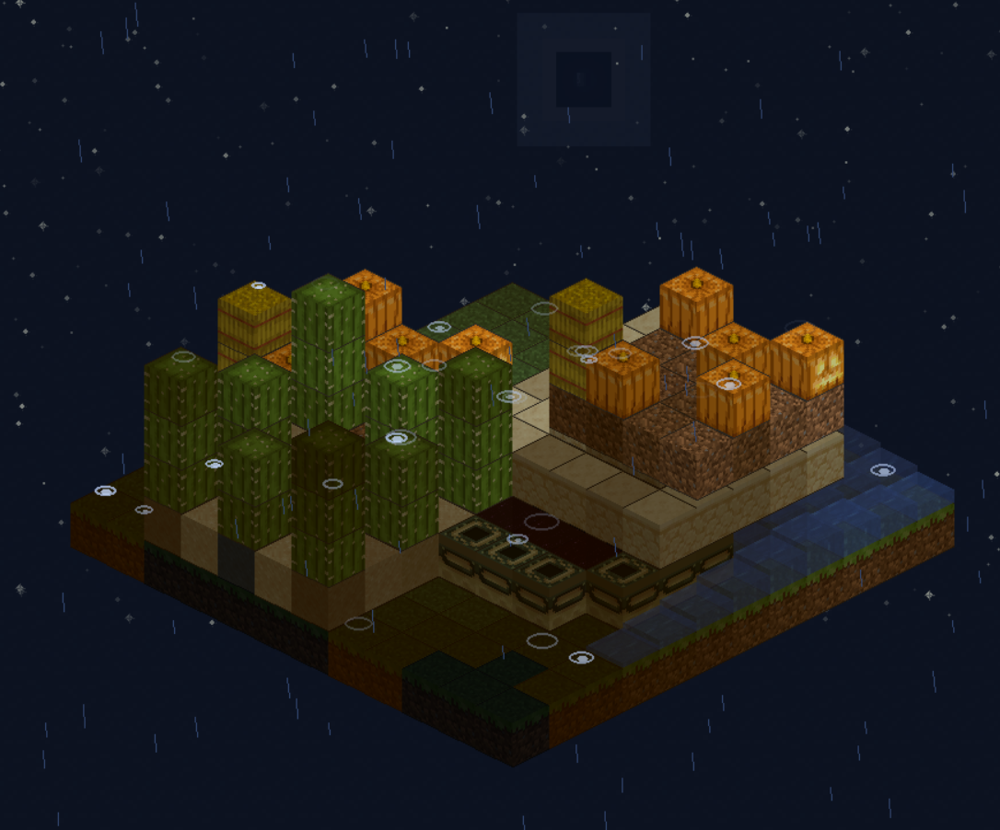
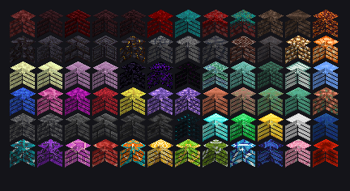
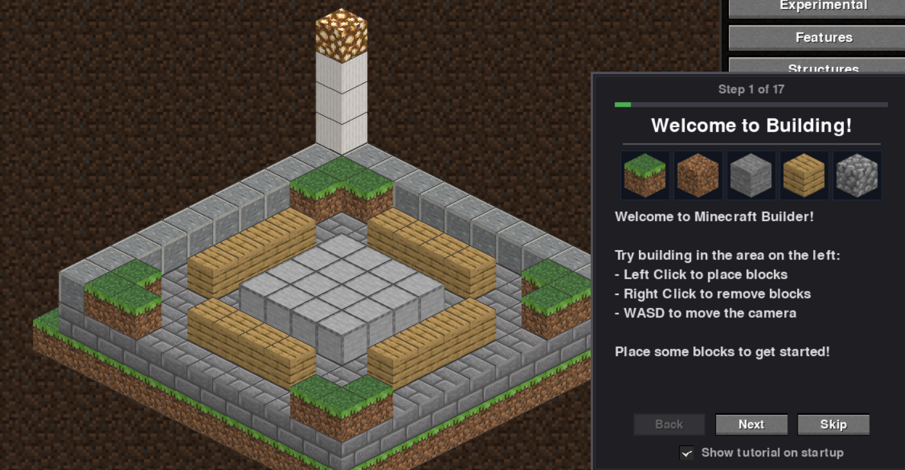
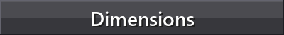
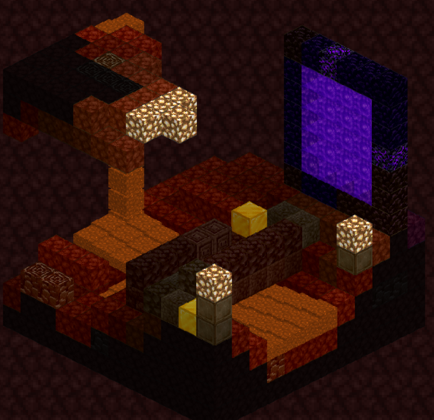
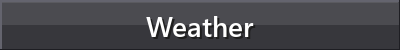
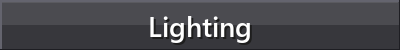
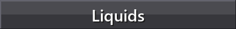

# Bite Sized Minecraft
##### An Interactive Isometric Building Simulator in Pygame. This is an unofficial fan project and is **NOT** affiliated with, endorsed by, or connected to [Mojang Studios](https://www.minecraft.net/) or Microsoft. All block textures and sound effects are sourced from the official [Minecraft Resource Pack Template](https://aka.ms/resourcepacktemplate) and the [Minecraft Wiki](https://minecraft.wiki/), used here for educational and non-commercial purposes only. Minecraft® is a registered trademark of Mojang Synergies AB. 


---

## Overview

Bite Sized Minecraft is a **creative building sandbox** that brings the essence of Minecraft's block-placing experience into a clean, isometric 2.5D perspective. Built entirely in Python with Pygame, this simulator allows users to place authentic Minecraft blocks onto a grid-based canvas, construct structures, and explore different dimensions—all with the familiar sounds and textures of the original game.



The project serves as both a **creative tool** for designing and visualizing Minecraft-style builds and a **technical demonstration** of isometric rendering, sprite management, and interactive GUI design in Python. Every block placement triggers authentic sounds with 3D positional audio—volume fades with distance, and stereo panning shifts based on where the block is placed on screen.

*The world remembers every block you place.*

**Goal:** Provide an accessible, lightweight building sandbox where users can experiment with block placement, load pre-made structures, and explore the creative possibilities of voxel-based construction without the overhead of a full 3D engine.

---

## Features

### Block Placement & Building

The core experience revolves around intuitive block placement on an isometric grid. A ghost preview shows exactly where your block will land before you commit, and an unlimited undo/redo system (Ctrl+Z / Ctrl+Y) ensures you can always fix mistakes—or undo them one hundred times over if needed.

Building tools include adjustable brush sizes (1×1, 2×2, 3×3) for rapid construction, a fill tool for quickly covering large areas, and mirror mode for perfectly symmetrical builds. All saves are automatically compressed and backed up, so your creations are never lost.

*...and some features that found their way in on their own.*

### 100+ Block Types

Over 100 authentic Minecraft blocks organized into expandable categories. Water, lava, fire, and portals feature real-time animations that bring your builds to life.



| Category | Examples |
|----------|----------|
| **Natural** | Grass, Dirt, Stone, Sand, Gravel, Snow, Ice |
| **Wood** | Oak, Birch, Spruce, Dark Oak, Acacia, Jungle |
| **Ores** | Coal, Iron, Gold, Diamond, Emerald, Lapis, Redstone |
| **Nether** | Netherrack, Soul Sand, Blackstone, Basalt, Ancient Debris |
| **End** | End Stone, Purpur, Obsidian |
| **Decorative** | Glass, Wool (16 colors), Concrete, Terracotta |
| **Interactive** | Doors, Stairs, Slabs, Chests |
| **Liquids** | Water, Lava (with flow simulation) |

### Special Block Behaviors

```python
# Stairs can be rotated to face different directions
if event.key == K_r:
    rotate_stair_facing()  # Cycles: North → East → South → West

# Slabs can be flipped between top and bottom position
if event.key == K_f:
    flip_slab_position()   # Toggles: Bottom ↔ Top

# Doors can be opened and closed with right-click
if right_click_on_door:
    toggle_door_state()    # Swings open/closed with sound
```

### Pre-made Structures

Instantly place complete structures—houses, towers, trees, portals, temples, and more. Load bastion remnants from the Nether or end city towers from the void. The structures panel lets you preview each build before placing it in your world.

---

## Interactive Tutorial



A comprehensive tutorial guides users through all features, from basic block placement to advanced tools like mirror mode and dimension switching. Each step demonstrates concepts hands-on with example structures you can interact with immediately.

*The tutorial will always be here for you. Always.*

---




Three distinct dimensions await, each transforming your building canvas with unique floor textures, ambient soundscapes, and atmospheric music. Switching dimensions doesn't just change the scenery—it transports you to an entirely different realm with its own character and mood.

### Overworld

The default dimension greets you with familiar grass-covered ground and the gentle sounds of a calm meadow. Peaceful piano melodies drift in the background as you build under open skies. This is home—comfortable, safe, and full of creative possibility.

### Nether



Step through the portal and the world transforms. Netherrack stretches beneath your feet, cracked and ancient. The air fills with deep, ominous rumbling—the sound of a realm that exists in eternal twilight between fire and shadow. Crimson forests and warped fungal growths dot the landscape, their bioluminescent glow cutting through the perpetual haze. Here you'll find soul sand valleys, bastions of blackstone, and rivers of flowing lava that illuminate the darkness with their molten glow. The music shifts to something darker, more primal—drums echo in the deep.

### The End

Journey to the edge of existence itself. End stone forms an alien landscape floating in an infinite void, its pale yellow surface stark against the absolute darkness that surrounds it. The atmosphere here is different—ethereal, empty, unsettling. Distant, haunting tones drift through the emptiness, and the purple-tinged sky holds no stars, no sun, no moon. End cities rise from the void, their purpur spires reaching toward nothing. This is a place of endings, where the familiar rules of the world no longer apply.

---




Weather transforms your world from a static canvas into a living, breathing environment. The system simulates realistic atmospheric effects that respond to the space around them, creating moments of beauty and drama as you build.

When rain begins, it starts subtly—a few drops here and there—before building into a full downpour. Each raindrop is individually simulated, falling at slightly different speeds and angles to create natural variation. As drops strike the ground, they burst into tiny splash particles that fade naturally. The intensity ebbs and flows over time, sometimes lightening to a drizzle, other times intensifying into a driving storm.

Thunder rolls across the sky at random intervals, accompanied by brilliant lightning strikes that illuminate your entire build in a flash of white. The lightning bolts themselves are procedurally generated, branching and forking realistically as they arc from sky to ground. During storms, the sky darkens gradually, casting your world in moody shadow.

Snow brings a gentler atmosphere. Delicate flakes drift downward with realistic physics, swaying side to side as they fall. The effect is constrained to your building platform, creating a cozy snow globe effect around your creations. An overcast pall settles over the world during snowfall, muting colors and softening shadows.

Clouds drift lazily overhead when enabled, their parallax movement creating depth against the sky. Multiple layers of clouds at different altitudes move at different speeds, building a convincing sense of atmosphere above your builds.

---




The lighting system adds depth and atmosphere through dynamic illumination. Light-emitting blocks cast a warm glow that propagates outward, falling off naturally with distance. Place a glowstone and watch as nearby blocks brighten; surround it with walls and observe how light fills the interior space.

Multiple light sources interact realistically, their influences combining to create nuanced illumination. A room lit by sea lanterns feels different from one lit by shroomlight—each source has its own color temperature and intensity. Magma blocks provide dim, ominous underglow, while jack-o'-lanterns cast their carved grins in warm orange light.

The day/night cycle brings its own lighting drama. The sun traces a smooth arc across the sky, its position determining the overall brightness of your world. As dusk approaches, colors shift toward warm oranges and purples. Night brings darkness, punctuated only by starlight and whatever artificial illumination you've placed. Stars twinkle overhead, their brightness fluctuating gently, and the moon cycles through eight distinct phases just as it does in the real Minecraft.

```python
# Light-emitting blocks and their intensities
GLOWSTONE:      lightLevel = 15  # Maximum brightness
SEA_LANTERN:    lightLevel = 15  # Cool, even glow
JACK_O_LANTERN: lightLevel = 15  # Warm, flickering
SHROOMLIGHT:    lightLevel = 15  # Organic luminescence
MAGMA_BLOCK:    lightLevel = 3   # Dim, dangerous glow
LAVA:           lightLevel = 15  # Molten brilliance
```

---




Water and lava behave as true fluids, flowing and spreading according to the same rules that govern them in Minecraft itself. Place a water source and watch it cascade downward, filling available space, spreading horizontally across flat surfaces, and tumbling over edges to continue its descent.

The flow simulation tracks liquid levels from 1 to 8, where 8 represents a source block and lower values indicate flowing liquid at various distances from the source. Water spreads quickly, seeking the lowest available path with each simulation tick. Lava moves six times slower, its molten viscosity creating a more ponderous, threatening spread.

When water meets lava, the interaction produces obsidian or cobblestone depending on the circumstances—source lava becomes obsidian, while flowing lava hardens to cobblestone. These interactions are accompanied by the satisfying hiss of rapidly cooling stone.

```python
def update_liquid_flow(liquid_type, position):
    """
    Simulate liquid spread from a source block.
    Water flows every 400ms, lava every 2400ms (6x slower).
    """
    current_level = get_liquid_level(position)
    
    # Flow downward first (gravity)
    if can_flow_to(position.below()):
        spread_liquid(position.below(), level=current_level)
    
    # Then spread horizontally with decreasing level
    for neighbor in horizontal_neighbors(position):
        if can_flow_to(neighbor) and current_level > 1:
            spread_liquid(neighbor, level=current_level - 1)
```

The liquid simulation runs continuously in the background, so you can place a water source at the top of a staircase and watch it tumble down step by step, or create lava falls that slowly creep toward your structures. Liquid flow can be toggled on and off if you prefer static water features.

---

## Mathematical Details

### Isometric Projection

The simulator employs a **2:1 dimetric projection**, the standard for pixel-art isometric games. This projection creates the illusion of 3D depth on a 2D canvas by rendering blocks at a fixed angle where horizontal movement translates to diagonal screen movement.

```python
def world_to_screen(grid_x, grid_y, grid_z):
    """Convert 3D world coordinates to 2D isometric screen position"""
    screen_x = (grid_x - grid_y) * (TILE_WIDTH // 2) + offset_x
    screen_y = (grid_x + grid_y) * (TILE_HEIGHT // 2) - grid_z * BLOCK_HEIGHT + offset_y
    return screen_x, screen_y
```

### Depth Sorting (Painter's Algorithm)

Blocks are rendered back-to-front using the **Painter's Algorithm**, where the sort key is the sum of coordinates. This ensures proper occlusion—blocks further from the viewer are drawn first and naturally covered by closer blocks.

```python
def render_world():
    """Render all blocks in correct depth order"""
    blocks_to_draw = []
    
    for (x, y, z), block_type in world.blocks.items():
        sort_key = x + y + z  # Isometric depth
        blocks_to_draw.append((sort_key, x, y, z, block_type))
    
    blocks_to_draw.sort(key=lambda b: b[0])  # Furthest first
    
    for _, x, y, z, block_type in blocks_to_draw:
        draw_block(x, y, z, block_type)
```

### Sparse World Storage

The world uses **dictionary-based sparse storage** for memory efficiency—only occupied positions consume memory:

```python
class World:
    def __init__(self, width, depth, height):
        self.blocks = {}      # (x, y, z) → BlockType
        self.properties = {}  # Special block states (doors, stairs, slabs)
        self.liquidLevels = {}  # Liquid level tracking (1-8)
```

---

## Controls

| Input | Action |
|-------|--------|
| **Left Click** | Place block |
| **Right Click** | Remove / Interact |
| **Middle Mouse** | Pan camera |
| **Scroll** | Zoom |
| **WASD** | Move camera |
| **Q / E** | Rotate view |
| **R** | Rotate stairs |
| **F** | Flip slab / Fill mode |
| **B** | Brush size |
| **M** | Mirror mode |
| **Ctrl+Z/Y** | Undo / Redo |
| **Ctrl+S/O** | Save / Load |

---

## Quick Start

```bash
# 1. Install
pip install pygame

# 2. Run
cd Code
python minecraftBuilder.py

# 3. Build!
# Left-click to place, right-click to remove
# Select blocks from the right panel
```

---

## Acknowledgments

This project would not be possible without:

- **[Mojang Studios](https://www.minecraft.net/)** for creating Minecraft and providing the resource pack template
- **[Minecraft Wiki](https://minecraft.wiki/)** for comprehensive texture and sound documentation
- **[Pygame Community](https://www.pygame.org/)** for the excellent 2D game framework
- *...and to those who watch from beyond the render distance*

> [!NOTE]
> This simulator is intended as a creative sandbox and technical demonstration. For the full Minecraft experience, please support the official game at [minecraft.net](https://www.minecraft.net/).

---

*Author: Jeffrey Morais*

---

<p align="center">
  
</p>

<p align="center"><i>???</i></p>
